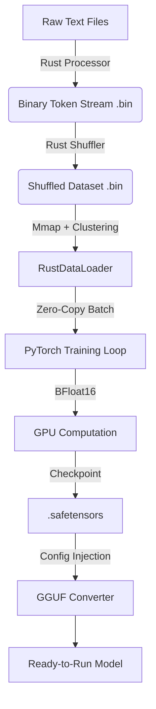

# Архитектура BulbaGPT Studio: Технический анализ и спецификация

**Версия документа:** 2.5 (FOSS Edition / Rust-Core)
**Объект:** Интегрированная среда разработки (IDE) для полного цикла создания SLM (Small Language Models) с акцентом на славянские языки и оптимизацию под Consumer Hardware (8-24GB VRAM).

---

## 1. Введение: Философия "Vertical Integration"

В отличие от стандартного подхода (HuggingFace Trainer + Python DataLoader), BulbaGPT Studio реализует концепцию **"Вертикальной интеграции"**. Мы заменяем критические узлы стандартного стека (загрузка данных, токенизация, шафлинг) на нативные модули Rust, вызываемые через FFI (Foreign Function Interface) с помощью `pyo3`.

Это решает три главные проблемы обучения на локальных ПК:
1.  **Python Global Interpreter Lock (GIL):** Блокировка потоков при подготовке батчей.
2.  **RAM Bottleneck:** Невозможность загрузить датасеты > RAM (стандартный PyTorch Dataset хранит данные в памяти).
3.  **IO Latency:** Медленное чтение миллионов мелких файлов с диска.

---

## 2. Data Engine: Rust-Based Pipeline

Ядро системы — библиотека `bulba_rust`, написанная на Rust с использованием параллелизма `Rayon` и `Memmap2`.

### 2.1. In-Memory Tokenizer Trainer (`trainer.rs`)
Вместо использования готовых токенизаторов, система обучает свой BPE (Byte-Pair Encoding) "на лету" на подвыборке данных.
*   **Safe Sampling:** Алгоритм случайным образом выбирает сэмплы из датасета до достижения лимита (100MB), чтобы не перегрузить RAM.
*   **Конфигурация Llama-3:** Генерируется токенизатор с поддержкой regex-правил Llama-3 (NFC normalization) и специфических спец-токенов (`<|begin_of_text|>`, `<|start_header_id|>` и т.д.).
*   **Результат:** Полная совместимость структуры токенизатора с экосистемой Llama 3, но со словарем, оптимизированным под целевой язык.

### 2.2. Parallel Processor (`processor.rs`)
Модуль процессинга сырых текстовых файлов в бинарный формат `.bin`.
*   **Chunked Reading:** Файлы читаются блоками по 64MB для минимизации системных вызовов (`syscalls`).
*   **Rayon Parallelism:** Текст разбивается на строки и токенизируется параллельно на всех ядрах CPU.
*   **Zero-Copy Serialization:** Токены конвертируются в `u16` (2 байта) "на лету" и пишутся в буфер.
*   **Background Writer:** Запись на диск вынесена в отдельный поток через `mpsc::sync_channel`, чтобы IO операции не блокировали CPU-интенсивную токенизацию.

### 2.3. Hyper-Speed Shuffler (`shuffler.rs`)
Алгоритм перемешивания огромных датасетов (больше RAM) без их полной загрузки.
1.  **Index Scan:** Rust сканирует `.bin` файл через `mmap` и находит позиции EOS токенов (границы документов), создавая индекс смещений `(offset, length)`.
2.  **Pointer Shuffle:** Перемешивается только вектор индексов (весящий мегабайты), а не сами данные (гигабайты).
3.  **Sequential Write:** Данные копируются в новый файл в случайном порядке, используя буферизированную запись (64MB buffer).

### 2.4. Smart Loader: Clustered Streaming (`loader.rs`)
Замена стандартному `torch.utils.data.DataLoader`.
*   **Memory Mapping (Mmap):** Файл датасета мапируется в виртуальную память. ОС сама управляет подгрузкой страниц.
*   **Clustered Order:** Для HDD/SATA SSD реализован алгоритм "кластерного чтения". Сэмплы перемешиваются, но группируются в кластеры по ~64MB. Это обеспечивает случайность обучения, но сохраняет последовательный доступ к диску (sequential read), что в 10-50 раз быстрее рандомного чтения (random seek).
*   **Unix Optimization:** Использование системного вызова `madvise(..., MADV_DONTNEED)` после чтения батча. Это принудительно освобождает страницы памяти, предотвращая "раздувание" кэша ОС и OOM Kill.

---

## 3. Нейросетевая Архитектура и Обучение

### 3.1. Топология: Scaled Llama-3
Используется архитектура `LlamaForCausalLM` с модификациями под малый масштаб.
*   **BFloat16 Mixed Precision:** Обучение ведется в формате `bfloat16` (на Ampere+ GPU). Это исключает необходимость в `GradScaler` (в отличие от fp16), повышая стабильность обучения и экономя память.
*   **Архитектурные пресеты (Presets):**
    *   *Krolik (45M)* / *Vorona (110M)* — для быстрых тестов и Edge-устройств.
    *   *AIst (250M)*: `layers=16`, `heads=16`, `kv_heads=4` (GQA Ratio 4:1).
    *   *Zubr (600M)*: `layers=22`, `heads=24`, `kv_heads=8` (GQA Ratio 3:1).
*   **Grouped Query Attention (GQA):** Агрессивное сжатие KV-кэша (в 3-4 раза) для ускорения инференса на CPU.

### 3.2. Методы стабилизации и оптимизации
1.  **NEFTune (Noisy Embedding Fine-Tuning):** Внедрение равномерного шума в эмбеддинги во время обучения (`dataset.py`). Предотвращает переобучение на малых датасетах и улучшает качество генерации в чат-режиме.
2.  **Torch Compile:** Использование бэкенда `Inductor` (`mode="reduce-overhead"`) для JIT-компиляции графа и фьюзинга CUDA-ядер.
3.  **8-bit Optimizers:** Интеграция `bitsandbytes.optim.AdamW8bit`. Состояние оптимизатора квантуется до 8 бит, что экономит ~75% памяти, занимаемой оптимизатором (критично для GPU с 6-8GB VRAM).

---

## 4. Dataset Mixing Strategy (`dataset.py`)

Реализован **Streaming Mixer**, который комбинирует источники данных с разной стратегией выборки:

1.  **Upsampling (Pure/Instruct):** Высококачественные данные (книги, Alpaca Instruct) дублируются (x3 - x5) для лучшего запоминания стиля.
2.  **Streaming (Web/Wiki):** Массивные корпуса (CulturaX, Cosmopedia) читаются в потоковом режиме или через итераторы parquet-файлов, чтобы не забивать диск и память.
3.  **Llama-3 Formatting:** Все данные приводятся к единому формату промптов:
    ```
    <s>System: ... \n\n### User: ... \n\n### Assistant: ... </s>
    ```
    Это обеспечивает совместимость с "чат-режимом" сразу после обучения.

---

## 5. Pipeline Экспорта и Совместимости (`main.py`)

Система решает проблему "Vendor Lock-in", обеспечивая экспорт в открытый стандарт GGUF.

### 5.1. Automated GGUF Conversion
1.  **Environment Preparation:** Скрипт создает временную структуру директорий, имитирующую репозиторий HuggingFace.
2.  **Config Injection:** Генерируется чистый `config.json` с параметрами архитектуры (rope_theta, norm_eps), который гарантированно принимается скриптом конвертации `llama.cpp`.
3.  **On-Demand Tooling:** Скрипт `convert_hf_to_gguf.py` скачивается автоматически с официального репозитория `ggerganov/llama.cpp`, если он отсутствует.
4.  **Vocab Compatibility:** Токенизатор и модель сохраняются так, чтобы маппинг ID токенов совпадал (благодаря обучению BPE с фиксированным размером словаря в Rust).

---

## 6. Схема Потоков Данных (Data Flow)



## 7. Аппаратные требования и масштабируемость

*   **Минимальные:** CPU (Apple M1/M2/M3) или NVIDIA GPU (6GB VRAM) + 16GB RAM.
*   **Рекомендуемые:** NVIDIA RTX 3060/4060 (12GB VRAM) + 32GB RAM.
*   **Масштабируемость:**
    *   *RAM:* Потребление RAM процессом Python константно (~1 GB) благодаря `mmap` и Rust, независимо от размера датасета (хоть 1TB).
    *   *Disk IO:* Линейно зависит от скорости диска. NVMe SSD настоятельно рекомендуется для эффективной работы `loader.rs`.